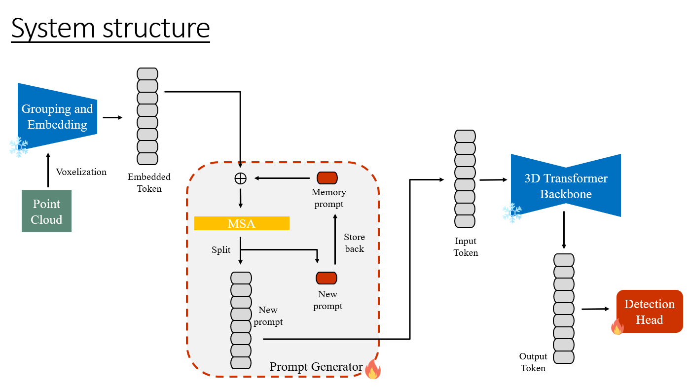

1. dsvt_addset:
    Adding extra sets in each windows.

2. dsvt_addvoxel:
    Adding extra voxels which concatenate on batch_dict['voxel_features']

3. dsvt_pg:
    Adding extra voxels like dsvt_voxel.
    Using a 4-layers prompt generator to generate a pi(1, 192).
    pi do expend and add on extra voxels.

4. dsvt_pg2:
    Directly Using a 4-layers prompt generator to generate a prompt(1, 192).
    concatenate prompt to each sets.

5. dsvt_addtoken:
    Adding extra tokens in each sets.

6. dsvt_addtoken_shallow:
    Adding extra tokens in each sets.
    Only apply on 1-st DSVT Block's X-Axis Partition.

7. dsvt_addtoken_shallow_temporal_v1:
    Adding prompt generator which combines the past token with the current scene 
    and then generate the current token.
    Only apply on 1-st DSVT Block's X-Axis Partition.
    

8. dsvt_addtoken_shallow_temporal_v2:
    Adding prompt generator which combines the past token with the current scene 
    and then generate the current token.
    Only apply on 1-st DSVT Block's X-Axis Partition.
    

9. dsvt_addtoken_shallow_temporal_v3:
    Adding prompt generator which combines the past token with the current scene 
    and then generate the current token.
    same with dsvt_addtoken_shallow_temporal_v2, but in prompt generatotr, cancel using stroe back.
    Only apply on 1-st DSVT Block's X-Axis Partition.